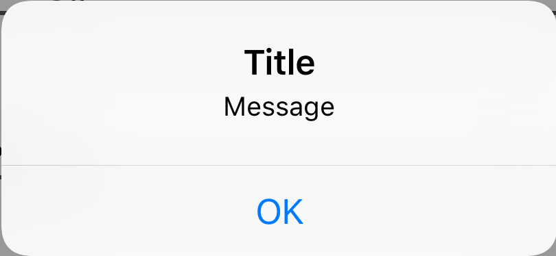

# ATAlertController

[](https://developer.apple.com/iphone/index.action)


UIAlertController for swift

## Usage

### One Button Alert

```swift
Alert(title: "Title", message: "Message")
    .addAction("OK")
    .show()
```


### Multiple Button Alerts

```swift
Alert(title: "Title", message: "Message")
    .addAction("Accept", style: .default, handler: { (action) in
        print("Accept action clicked")
    })
    .addAction("Cancel", style: .destructive, handler: { (action) in
        print("Cancel action clicked")
    })
    .show()
```


### Alerts with Text Field

```swift
var textField = UITextField()
Alert(title: "Title", message: "Message")
     .addTextField(&textField, required: true)
     .addAction("Ok", style: .default) { (action) in
                
     }
     .addAction("Cancel", style: .destructive) { (action) in
                
     }
     .show()
```

### Action Sheet

```swift
ActionSheet(title: "Title", message: "Message")
     .addAction("Google Maps", style: .default, handler: { (action) in
         print("Google Maps action clicked")
     })
     .addAction("Apple Maps", style: .default, handler: { (action) in
         print("Apple Maps action clicked")
     })
     .addAction("Cancel", style: .cancel, handler: { (action) in
         print("Cancel action clicked")
     })
     .show()
```


### Requirements

- Swift version 4.2
- Xcode 10.0+

## Installation

### Install Manually

- Download and drop 'ATAlertController.swift' in your project.

## Improvement
- Pull requests are welcomed.

## Author
[Arasu01](https://github.com/arasu01)

## License
- ATAlertController is available under the MIT license. See the [LICENSE file](https://github.com/thellimist/EZAlertController/blob/master/LICENSE).

## Keywords
Swift, ActionSheet, AlertView, UIAlertViewController